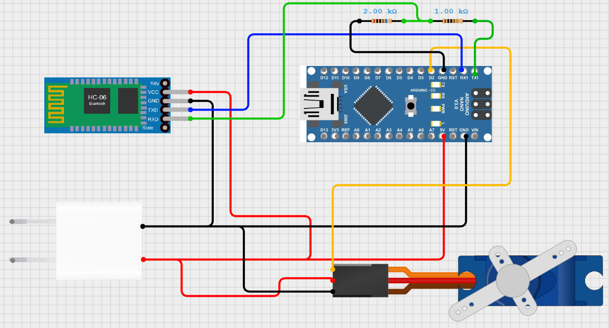
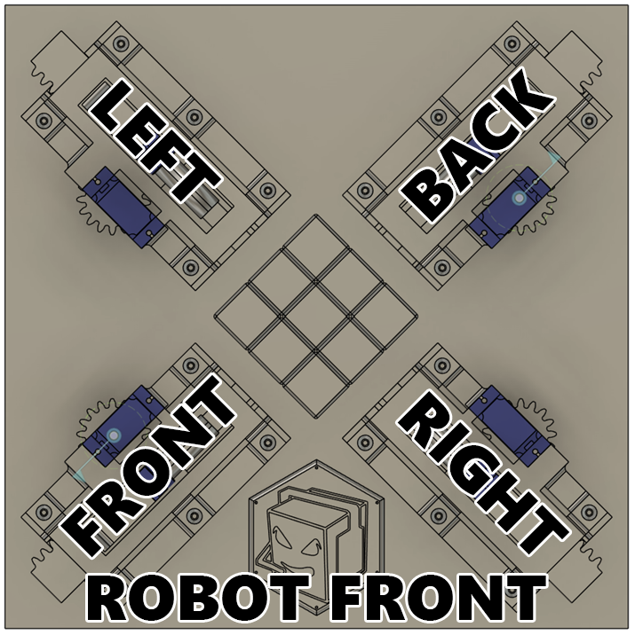

# Arduino
Here you will first find how to wire things up in the arduino, and how to calibrate your servos with documentation of the overall arduino code and how it works. This is the slave part with the API that sits there and waits for commands.

## Circuit
You need an HC-06 or HC-05 bluetooth module for communication. When wiring up the servos, the PWM pin (orange wire usually) does not matter as long as you connected to one of the D2-D15 pins on the arduino (D0 and D1 are RX and TX, avoid those!). The TX and RX pins should be hooked up to the arduino's TX and RX using a voltage divider (since HC-06 logic works with 3.3v and not 5v). Below diagram shows how to wire up the HC-06 with a single servo (do the same with with the otehr 7 servos and just connect them to any diginal GPIO pins, it doens't matter which goes where.). The below diagram also assumes the power adapter provides a steady 5v with 3 amps or above. You can add capacitors to the motors too but I didn't bother.


### Actuator Definition
Which pin you connected each servo to does not matter, but the code expects this exact actuator definition (assuming the front of the robot is where my logo is):  
  
Each actuator will have a slider servo and a spinner servo. The slider is what makes it slide back and fourth, it is the servo with the gear. The spinner is the servo with the grabber that grabs the side of the rubiks cube and spins it. The pins you connected must be configured later based on this exact definition.

### Servo States
This application has a single servo class, with the exact same states, but they mean different things for spinners and sliders.

#### Spinner servo
Each spinner servo can move to 5 distinct positions:
- **STATE_C**: Center (fully centered)
- **STATE_L**: Left (fully left)
- **STATE_R**: Right (fully right)
- **STATE_l**: Center-left (45° between C and L)
- **STATE_r**: Center-right (45° between C and R)

#### Slider servo
- **STATE_C**: Center (Barely touching the rubik's cube without stalling)
- **STATE_L**: Left (Fully pressing into the rubik's cube, stalling)
- **STATE_R**: Right (Release, slide out, in this state, spinner can move freely and won't touch the cube)  
I guess sliders have a STATE_l and STATE_r as well since they use the same servo class, but here they do not make sense :) they just exist...

## Configuration (`Config.h`)
Before flashing your arduino with any of my code, I recommend using the servo sweep example code that comes with the arduino IDE to test all your sliders and spinners, to make sure all the wiring is correct. Then, open [Config.h](Config.h). In this file, you will find the definition for all the servo pins. You should change these to whatever digital pins you connected your servos to, depending on the actuator definition we talked about earlier. The other configuration is in case you want to run the program in calibration mode instead of normal mode (we will talk about it soon) and two buffers. One for SEQ command, which let's you control each servo individually, and MOVE command which let's you tell the robot actual rubik's cube moves. These buffer sizes worked for me so I do not recommend changing them unless you have a reason to. We will talk about these commands later.

## Calibration
> ### SERVO LIBRARY ISSUE
> **NOTE:** Before calibrating your servos, please be aware that my servo class is an abstraction on top of the standard `Servo.h` Arduino library. 
>
> **THE ISSUE:** You may find your servos have a "hard-limit" where they stop at 45° and 135° and refuse to go further. This is a known overflow bug within the official Servo library itself.
>
> **THE FIX:** You must manually patch the library. I found a community fix that resolves this overflow issue:
> * **Fix Link:** [GitHub Commit 7b4f264](https://github.com/arduino-libraries/Servo/pull/101/commits/7b4f26462c5053ac967b237c602000ad9ba54200)
>
>I highly recommend applying this change in your local library files; otherwise, it may be impossible to calibrate the servos correctly.  

Each servo is different, and STATE_C can mean different things for different servos. So, we must calibrate them once everything is working. Set the CALIBRATE flag to true in [Config.h](Config.h). However, try not to stay in this mode for too long as it keeps the servos constantly powered. Even if they aren't stalling, they are constantly micro-adjusting and will overheat if you leave it in this mode for a long time. This is mainly because I was too lazy, but meh, it needs to be done just a single time. After you set the CALIBRATE flag, remove the HC-06 bluetooth module and flash the arduino. Once it's done, open a serial monitor (BAUD 9600) and type H. It should show this message:
```
Servo calibration tool commands:
0-7 : select servo
c   : set state CENTER to calibrate center
l   : set state LEFT to calibrate left
r   : set state RIGHT to calibrate right
+/- : increase/decrease step size
*// : increase/decrease step size * 10
</> : increase/decrease center deviation (spinners only)
p   : Print current calibration values
w   : Write calibration to EEPROM
```  
First, select a servo to calibrate by writing a number between 0-7 in the serial monitor, it will show what you selected and current pulse and state after you press enter. After that, select state by sending r, l or c. (STATE_r and STATE_l cannot be selected here because their pulse will be calculated as the pulse between your STATE_R and STATE_C pulse). The idea here is that each state should be associated with a pulse for each servo. I recommend putting all sliders in C state, make them hold the cube in the middle, then put them in state R and clibrate it so that they are just out of reach of the cube, then state L that makes them press into the cube (to hold it up).  
Then, move onto the spinners, make sure the R and L are not a fully horizontal grabber, but a grabber that spins a little further than that. Because the grabber is a little bit bigger than the cube, to compenstate for that gap, it needs to spin a little more than 180 deg and a little less than 0 deg. The cheapest servos I bought was able to do it with enough calibration so there shouldn't be a problem :)  
However, going back to the center is a nightmare because it also needs that compensation. If the grabber only goes to the center, the side of the cube won't be fully at the center otherwise. So, I added something called center deviation (might be a wrong name, this is compensasion) that makes the grabber go a little bit to the left off the center, if it's coming from the right, and vice versa. But if it's in the center and it gets another center command, then it will not add compensasion. So, for true center, just send the center command twice.
When all these calibrations are done, you can press P to print them, or W to write them to the EEPROM so when you run it in normal mode, they will be read from there.

## **API Layer** (`API.cpp/h`)

Turn off the CALIBRATE flag and flash the arduino again (still without HC-06). In the serial monitor from the arduino IDE, you can type H again and this help message will be printed:
```
Commands:
HELP
PING
STATUS [servo]
SEQ <string>|C
MOVE <delay_ms> <orientation> <moves>
```
- `PING` - Connection test (should respond with PONG)  

Before explaining the rest of these commands, we should explain how we refer to each servo and state and cube orientation.
- Servo:   
   `R`, `L`, `F` or `B`: refers to RIGHT, LEFT, FRONT or BACK Slider servo  
   `r`, `l`, `f` or `b`: refers to RIGHT, LEFT, FRONT or BACK Spinner servo  
- State:  
   `R`, `r`, `C`, `l`, `L`: STATE_R, STATE_r, STATE_C, STATE_l, STATE_L  
   These work the exact same for spinners and sliders, but don't use r and l for sliders, again, they do not make sense  
Because of the mechanics of this robot, it can not access the UP and DOWN faces of the cube directly. It must flip the entire cube around.
When the cube is flipped, the UP and DOWN faces become the RIGHT and LEFT faces in the robot. The Right and Left faces on the cube are now pointing up and down and are inaccessible directly. In this orientation after the robot is flipped, the orientation is `INVERT` and the orientation is `1`. When the cube is NOT flipped and the UP and DOWN cube faces are inaccessible, it is `NORMAL` and orientation is `0`  

### STATUS command
- `STATUS [servo]` - Query robot state (IDLE/BUSY) or individual servo state (R, C or L)

### SEQ commnad
- `SEQ <string>|C` - Execute a predefined servo sequence or cancel.
If you just send `SEQ C`. It will cancel ANY operation it is currently doing and disable all servos. This is good for some kind of ABORT button. If it's already IDLE it will not do anything.  
If you send a sequence string instead, it is built like this:
`"<SERVO><STATE><SERVO><STATE>[OPTIONAL DELAY]"` and so on...
The sequence string will be executed from left to right IMMEDIATELY at the same time! unless it encounters a delay in the string, in which case it will wait and that amount of milliseconds before continuing the rest.
Example:
```
SEQ rRBL250fr  → Move right spinner to R, back slider to L, at the same time!, wait 250ms, front spinner to R
```  
You should plan your delay so that spinners aren't hitting each other, servos have enough time to move into position, but making the delays too large will cause the sequence to slow down, which is not ideal. You should just experiment with it. The perfect servo calibration can have delays as low as 120ms! but start with 250ms.

### MOVE command
- `MOVE <delay> <orientation> <moves>` - Execute standard Rubik's notation moves (U, D, L, R, F, B)
While you can use SEQ command to manually execute moves, it is exhausting to think in terms of SEQ instead of MOVES. It is also not possible as it stores the entire sequence stirng in RAM. A single move involve at least 4 servos, 6 if a cube flip is needed (U and B moves). A simple solution string will quickly blow up to a SEQ command over 2kb! This is why you should use the MOVE command to execute moves intead!  
You tell it how long it should wait for servos to get into position after commanding them, the start orientation of cube (how it is oriented right now, this is 0 for most of the time but set it to 1 when you need to) and following by the moves string defined as:  
R, L, F, B, U, D -> clockwise cube rotation of that face.  
r, l, f, b, u, d -> counter-clockwise cube rotation of that face.  
I know the standard move string is "FBF'U2" bla bla bla... but I wanted a simpler version where each character in the string mean a move! the equivalent of the move string I just said in my definition will be "FBfUU".  
Example:
```
MOVE 210 0 UfRF  
→ Cube orientation is NORMAL now (0), execute UP clockwise, so flip cube, then turn the face 90 degrees clockwise. 
→ Turn the FRONT face counter-clockwise
→ Turm the RIGHT face clockwise, but the orientation is INVERT now, we flipped it before, so flip it back and turn RIGHT face clockwise
→ Turn FRONT clockwise
```
