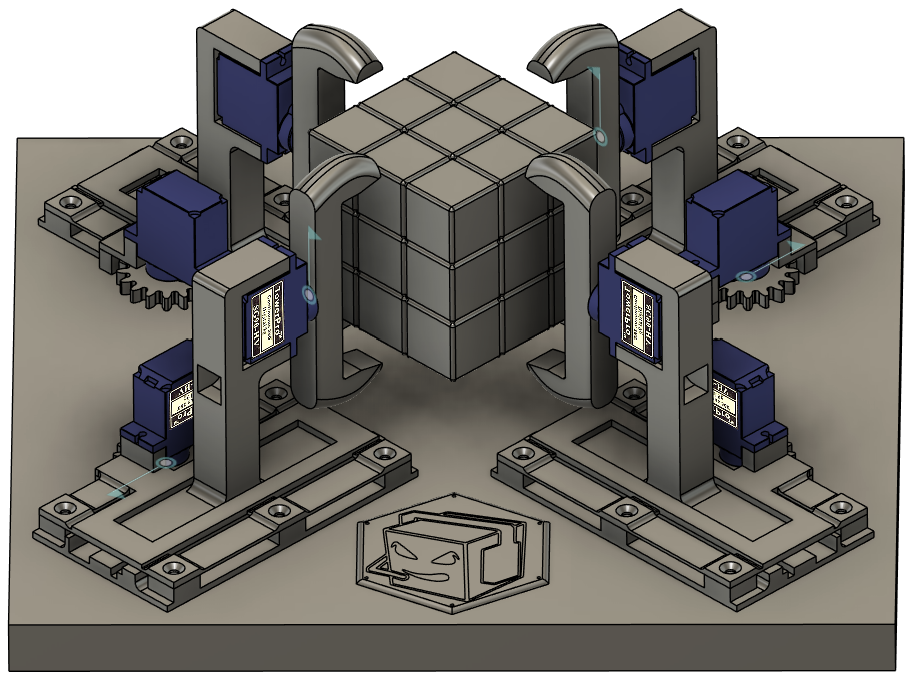
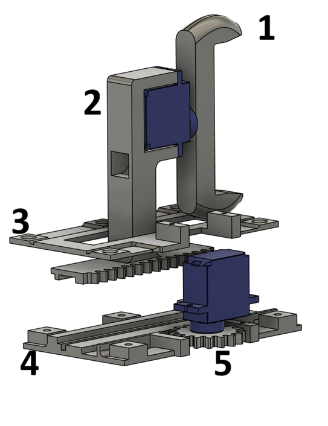
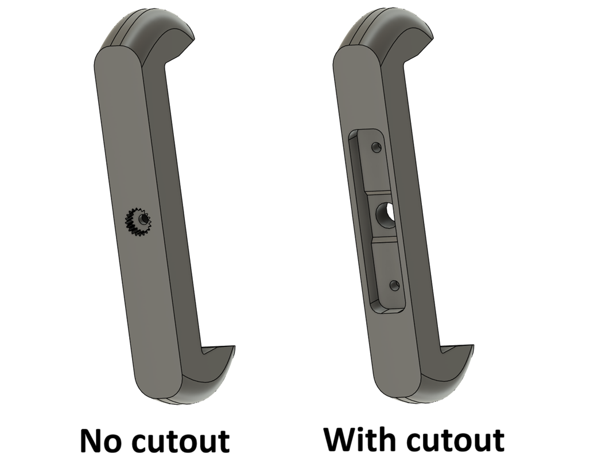
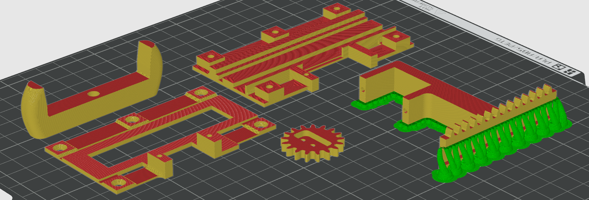

# Hardware
In this folder, you'll find STL files, Fusion 360 files, electronics and much more..

## What you'll need (aside from 3D printing)
A wooden base. Minimum dimensions of 240x240mm. But, in my case, I needed it a little longer for my breadboard, so I had 240x270mm. Make sure the width is 240mm and the length is at least 240mm, but it can be as long as you need. The depth should ideally be between 20-30mm since we will be screwing and nailing things on this base. But my point is, the actuators themselves will take up space of 240x240mm in total.

Eight servo motors (SG90 or its metal equivalent that has the same dimensions). 

A breadboard with some jumper wires for circuitry.

Power adapter that is a steady 5 volts and at least 3 amps. Anything less will not work, but ideally, I would recommend more amps.

An arduino, any arduino here will work, but I went with Arduino Nano since it is small and fits nicely on the breadboard.

A breadboard or a PCB, whatever you want to connect the wires and circuitry really..

HC-06 or HC-05 bluetooth module for communication between the phone and the robot.. oh, and, an android phone.

3mm wooden screws that are 15mm long (to screw things into the wooden frame) and extra small screws (the same type that comes with the servo).

## Screw holes
I have made something I called "drill_jig.stl" cuz idk what else to call it. Anyway, it is a part that you can 3D print that will help you with drilling the screw holes in the right place. You just grab your 240x240mm wooden base (or draw a square of that size on it) and line it up with each of the 4 corners, and it will show you where the holes should be. You can mark them, drill and then throw that part away. You can also create a 2D version of it if you want and print it on paper.

## 3D printing, STL and Fusion 360
Let's look at how the final robot should look like:

We can see four actuators. Two of them are normal and two of them are mirrored. (the definition of mirrored and normal is just my own). The upper-right in the image above and the bottom left actuators is what I defined as normal. The other two is what I defined as mirrored. Depending on where you want the gear and the servo to end up, you might want either all mirrored, all normal or like I did, two mirrored and two normal. If you want 3 mirroed or 3 normals you aren't normal :)

### Actuators
Each actuator is built up of 5 parts (aside from the two servos):
1. Grabber - the claw that grabs the rubiks cube. Mirroring doesn't matter for this one.
2. Slider - This is what holds the grabber and its servo, its the part that slides back and fourth.
3. Channel top - The part that holds the slider in the channel that it slides on. 
4. Channel bot - The channel itself that the slider should slide across. Since it can be rotated 180 degrees, mirroring shoudn't matter for this too.
5. Gear - This is what is mounted onto the bottom servo, that grabs the slider and pushes it back and fourth, also no mirroring. 

I hope this image makes the parts more clear:

All of these parts make up one actuator, and we want four of them. First decide mirroring and what direction you want the gear servo to face. From now on, I will go on making two normals and two mirrored actuators.

#### Grabber
I have designed two types of grabbers, you can choose any one you like. One of them has a perfect fit in my servos, it might not fit your servo. The other grabber has a cut-out where a servo arm can be mounted onto it (the thing that comes with your servo). 

#### Gear
The gear has small cutout too, I don't recommend having a snap-on without anything holding it in place as this will move the entire slider back and fourth. What I did is have the servo arm with two little umm.. things? at the side.. I just snap off the long arms and only use the short arms because the gear is smaller. I hope this image will make it make sense :D

#### 3D printing
Before 3D printing anything, keep in mind that all the hole sizes and dimensions and cutouts fit my servos and my setup. Make sure:
- The cutout for the servo arms (or the grabber without the cutout) actually fits your servos and servo arms
- The grabber itself is a little bigger than the side of your cube (there must be a small 3-5mm gap between them, the cube should never get stuck inside the grabber)
- The screw holes themselves om the channel top and bottom, these will be screwed onto the wooden base
- The slider and the channel bottom, have a tolerance of 0.15mm, depending on your printer, you might wanna check that too otherwise it will not smoothly slide

I will make the Fusion 360 (where I designed them) files of these parts available in the Fusion 360 folder in this directory, you should be able to load them into Fusion and tweak them if you need to.

This is how I recommend you 3D print all parts (showing a single, normal actuator, the mirrored version should be printed in the exact same way)

The key takeaway is that, the gears on the slider needs to point up, only support the entire bottom face, and the two things that stick out at the bottom that will go into the channel later. Make it a manual tree support in Bambu Slicer. Also, make the channel bot (part numebr 4) has a top surface pattern set to concentric, so that the layer lines go along the channel, making the slider slide onto it smoothly.

When you have 3D printed these parts, you put them together like this:
But the bottom channel(4) on the wooden base. Put the slider(2) on it and make sure they slide smoothly (not too stiff or too wobbly). Put the top channel part(3) on top of them and screw them together onto the wooden base (5 screws in total).

Now, you can grab two servos, mount the gear on one servo and the grabber on the other (make sure the grabber is mounted in a way that lets it go between fully left, middle, and fully right). Slide the slider all the way in, rotate the gear manually so that it is also all the way in and mesh them together (to make sure the limit of the servo is literally the limit of how much you can push in the slider). Then just screw it in place. You should be able to slide the slider using the servo now, all the way in and however far back it goes (it goes back way too far we won't use all of it). Screw the grabber servo in place too and now you should have one actuator done. Repeat this 4 times.
